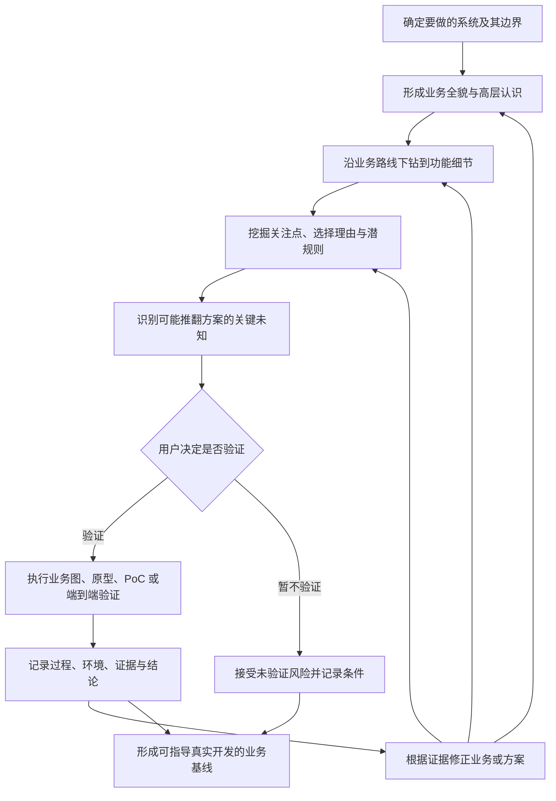

# VCDDD 2.0 阶段性成果（三）：Skill 前半段——从业务全貌到可开发业务基线

> 状态：VCDDD 2.0 Skill 前半段的阶段性设计，不是最终运行时 Skill
>
> 日期：2026-07-21
>
> 前置文档：
>
> - [VCDDD 2.0 的思考起点](./1-starting-point.md)
> - [从通用语言到共同决策上下文](./2-shared-decision-context.md)

## 1. 本文的位置与范围

前两阶段已经明确了 VCDDD 2.0 的核心目标：让人类与不同职责的 AI，通过共同领域模型、通用语言和显性的决策上下文，连续地理解、设计、实现并迭代同一个系统。

本文开始回答“怎样实现这个目标”，先收敛当前最紧急的一类任务：具有前后端界面、业务操作与服务端能力的产品或系统。

这不是对所有软件产品的最终抽象。客户端工具、基础设施、数据系统和其他产品形态可能需要不同的探索与验证方式，后续应在更多真实案例中继续提升抽象层次。本文先形成一个能够实际试运行的前半段。

这里所说的“前半段”，是指：

> **从用户最初提出要做一个东西开始，经过业务全貌、业务细节、隐藏知识与关键未知的探索，以及必要的验证，最终形成足以指导真实开发、且已知风险透明的当前业务基线。**

本文暂不设计后半段的正式技术设计、代码实现、系统级验证和持续迭代机制。

## 2. 前半段的目标

前半段不是生产一份传统需求文档，也不是要求用户在开发前一次性说清全部业务真相。

它需要使人和 AI 共同获得：

- 对本次要做的系统本身的完整高层认识；
- 从宏观业务路线下钻到可实现功能的详细理解；
- 用户真正关注的结果、风险和体验；
- 重要规则、选择、变化背后的内部原因；
- 原本存在于经验和组织习惯中的隐藏知识；
- 可能推翻当前方案的关键未知；
- 已完成验证所提供的证据和适用范围；
- 暂未验证但已经明确接受的风险；
- 能够指导后续技术设计、测试和代码的当前业务基线。

“完成”不表示以后不会再发现新事实，而表示当前理解已经足以支持真实开发，剩余未知没有被隐藏。

## 3. 基本工作原则

### 3.1 阶段服从问题，不让问题服从阶段

业务全貌、细节探索、验证和基线形成是需要承担的工作，不是不可回退的程序化门禁。

任何新证据都可以让工作立即返回前面的业务理解或方案选择。AI 不得因为“当前已经进入验证”或“需求已经确认”而延迟反馈、掩盖矛盾或继续执行已经失效的方向。

### 3.2 先形成整体解释，再集中纠偏

AI 不应把业务理解退化成大量连续小问题。用户常常只有在看到一个相对完整的系统解释、业务图或原型之后，才能判断遗漏、错误和不必要的复杂度。

AI 应主动提出有依据的整体理解，同时明确标出其中的推断和待确认内容，再让用户集中纠偏。只有会实质改变业务方向、利益、风险或范围的问题，才需要及时要求用户决定。

### 3.3 重要反馈立即进入共同上下文

用户纠正、图形冲突、原型反馈、技术调查和实现发现都可能改变业务理解。反馈出现时，应立即判断它影响业务全貌、详细路线、判断准则、方案还是验证结论，并更新相应记录。

### 3.4 不确定性决定验证方式

不应因为要做网页就默认生成原型，也不应因为开始写代码就默认采用生产级测试。

AI 应先识别当前最可能推翻设计的未知，再选择能够以最低成本提供可信证据的验证方式。验证对象决定哪些部分必须真实，其他部分只需要达到不干扰结论的程度。

### 3.5 用户决定是否投入重要验证

AI 负责识别关键未知、推荐验证方式，并解释验证成本、不验证风险及其对方案的影响。是否投入具有明显成本、时间或外部影响的验证，由用户决定。

如果用户选择暂不验证，AI 必须记录这是一项被接受的未验证风险，不能把它改写成已经成立的事实。

## 4. 整体工作循环



这张图表达工作之间的关系，不规定每个项目只能按一次固定顺序执行。关键未知可能在任何位置出现，验证也可能多次发生。

## 5. 确定本次真正要做的系统

第一项工作是区分“系统本身”和“环境背景”。

### 5.1 系统本身

系统本身是本次需要共同理解、设计和开发的业务。它需要被完整讨论：目标、参与者、业务路线、判断、功能、结果、例外和风险。

### 5.2 环境背景

外部系统、组织流程、已有平台和上下游能力可能影响当前系统，但不一定属于本次需要完整设计的业务。

对于背景信息，只需要明确：

- 它为当前系统提供什么；
- 当前系统依赖它什么；
- 双方业务边界在哪里；
- 它施加了什么约束；
- 它发生变化时会影响当前系统什么。

例如，中台向 TokenHub 提供已有用户。中台内部怎样创建和治理用户属于背景；TokenHub 怎样为已有用户配置模型、用量档位模板和 Key 才属于本次业务。

如果不先确定系统边界，AI 很容易把背景系统一起展开，导致范围膨胀和业务重点丢失。

## 6. 形成业务全貌与高层认识

业务全貌不是页面清单、接口清单或代码模块图。它应让没有历史语境的人和 AI 快速看懂：

- 系统为什么存在；
- 它直接服务哪些参与者；
- 各参与者希望得到什么；
- 系统接收什么，产生什么结果；
- 它包含哪些主要业务能力；
- 存在哪些彼此独立的宏观业务路线；
- 什么属于当前范围，什么只是背景；
- 什么结果代表目标达成；
- 哪些结果即使局部指标改善也不可接受。

业务全貌适合使用简洁业务说明与分层图形表达。图是共同业务理解的一等持久化投影，而不是一次性汇报材料。

### 6.1 业务图的作用

AI 应先判断当前需要验证的是整体业务、系统组成、业务路线、对象状态、交互顺序还是复杂判断，再选择最小有效图形：

- 业务全景图表达参与者、价值和外部关系；
- 系统组成图表达能力、责任和边界；
- 流程图表达一条业务路线的入口、判断、分支与结果；
- 状态图表达重要对象的生命周期；
- 时序图表达跨参与者交互的先后关系；
- 决策图或决策表表达复杂条件和结果。

不是每个项目都必须生成全部图，也不预先规定固定层数。下一层图只在上一层仍有重要关系没有看清时继续展开。

### 6.2 图是理解与验证工具

图应使用当前项目的通用语言。人负责判断图中的业务关系是否正确，AI负责通过图暴露遗漏、错误合并、职责冲突和顺序矛盾。

如果流程图、状态图和时序图对同一业务使用了不同术语、判断责任或结果，应把它视为业务理解冲突，而不是绘图问题。

图不能代替选择理由、证据和隐藏知识。它是业务模型的结构骨架，其他记录负责解释这副骨架为什么成立、是否经过验证以及如何演化。

## 7. 从业务路线下钻到功能细节

从全貌进入细节时，不能直接把宏观能力拆成页面和按钮。更合理的下钻关系是：

```text
宏观业务路线
→ 具体业务情境
→ 参与者想完成的事情
→ 系统需要作出的判断
→ 正常结果和重要分支
→ 为承载这些行为需要提供的功能
→ 页面、接口和其他交互入口
```

业务功能应从业务情境与行为产生，而不是从当前页面或常见产品结构反推。

### 7.1 一条业务路线需要看见什么

根据业务实际复杂度，AI 应帮助人看见：

- 从什么情境进入；
- 谁发起、谁参与；
- 参与者试图获得什么结果；
- 系统需要知道什么；
- 在哪里发生业务判断；
- 正常路线怎样结束；
- 哪些条件产生不同分支；
- 失败、取消、重复和恢复是否会改变业务意义；
- 结果会影响哪些后续路线。

这不是要求所有路线机械填写同一组分支。只有会改变业务结果或暴露隐藏规则的情况才需要展开。

### 7.2 从业务细节得到功能

当业务路线已经清楚，才能确定系统需要提供哪些功能，并进一步映射为：

- 用户可以看见和执行的操作；
- 服务端需要作出的判断；
- 需要保存或查询的信息；
- 外部系统需要提供的能力；
- 必须反馈给用户的状态与结果。

页面只是这些功能的一种表现，不应成为业务拆解的起点。

## 8. 挖掘用户关注点、选择理由与潜规则

每项重要功能和规则都需要继续追问使其成立的内部原因。

AI 应帮助表达：

- 用户为什么关注这项能力；
- 什么结果最重要；
- 什么情况最不能接受；
- 当前为什么采用这种行为；
- 曾考虑过哪些替代方案；
- 当前选择依赖什么隐藏前提；
- 有哪些适用范围与例外；
- 什么变化会让它需要重新设计。

### 8.1 通过操作与反例挖掘隐藏知识

隐藏规则很少能通过“还有什么规则吗”直接得到。AI 应根据对象和路线的重要性，选择性地讨论：

- 创建与首次进入；
- 修改与重复操作；
- 替换与重新绑定；
- 停用、失效与恢复；
- 作废后的存量行为；
- 取消、中断与失败；
- 权限或外部依赖变化。

例如，模板作废规则只有在继续讨论已有 Key、新绑定和更换 Key 后，才完整形成“存量继续、新绑定禁止、更换属于新绑定”的业务语义。

### 8.2 显性化不等于固化

潜规则被发现后，AI 必须区分它是现实事实、当前政策、价值判断、经验假设、组织惯例还是临时妥协。只有经过审视后，才能决定保留、拒绝、暂用或继续验证。

## 9. 识别可能推翻方案的关键未知

关键未知不是最后才进行的一次风险检查，而应从业务全貌开始持续维护。

对于每个可能卡点，AI 应明确：

- 想确认的命题是什么；
- 它影响哪个业务目标、功能或方案；
- 当前为什么不确定；
- 如果不成立，会推翻局部设计还是整体路线；
- 可以通过什么方式获得证据；
- 验证时哪些部分必须真实；
- 验证成本与不验证风险分别是什么。

AI 应优先指出最可能推翻方案、越晚发现代价越高、无法仅靠讨论解决的未知。

## 10. 选择与执行验证

原型、技术 PoC、最小端到端实现和业务图都属于验证性产物。它们的共同目的，是判断某个理解、目标、关键假设或候选方案是否成立。

### 10.1 语义理解验证

使用业务全景图、流程图、状态图、时序图或决策图，将当前理解变成可观察结构。适合验证参与者、路线、状态、判断归属、分支和交互顺序是否被正确理解。

### 10.2 页面业务与交互验证

使用具有足够功能完成度、统一页面风格和代表性假数据的可交互原型。适合验证：

- 业务功能假设是否完整；
- 用户是否理解操作路线；
- 页面信息层级是否反映业务重点；
- 文案、动作与数据量级是否符合真实使用。

原型只需要稳定到足以支持业务学习。通常不需要完整单元测试、全量 E2E、生产级错误处理、安全、性能和可恢复性。最低验证是能够启动、主要演示路线不被阻断、明显视觉问题不会干扰判断。

### 10.3 技术能力验证

使用技术 PoC，在真实平台、接口、运行环境和决定性约束下验证某项能力是否可行。关键节点不能通过 Mock 伪造；页面和非关键结构可以保持最低限度。

Bifrost 能否支持共享限流、客户端能否真正隔离微信数据等问题属于这一类。

### 10.4 核心流程验证

使用最小端到端实现，让真实数据穿过决定方案成败的核心节点。非关键部分可以临时替代，但不能在关键链路使用假实现掩盖问题。

### 10.5 验证对象决定真实性

不存在统一的高保真或低保真。页面原型可能要求业务行为和视觉高度真实，但允许后端临时；技术 PoC 可能要求运行环境和关键接口真实，但页面极其粗糙。

验证性实现的质量标准是能够提供可信证据，而不是达到正式产品的工程完整度。

## 11. 记录验证过程、结果与负面经验

一次尝试失败只能证明：在当时的环境、版本、配置、路径和实现方式下，本次尝试没有成功。它不能自动证明目标本身不可实现。

验证记录需要使下一位参与者能够判断证据的真实边界，至少应保存：

- 要验证的命题；
- 对应的目标、业务路线和候选方案；
- 为什么需要验证；
- 时间、环境、版本和关键配置；
- 实际过程与观察；
- 失败发生的位置；
- 已排除与尚未排除的可能原因；
- 尝试过的替代方式；
- 结论是支持、反驳还是证据不足；
- 哪些能力已经被否定，哪些只是本次未成功；
- 什么条件变化后值得重新验证；
- 结果使哪个理解或方案继续、修改或被放弃。

负面经验必须附带足够具体的适用条件，不能被压缩成“这种方式不可行”。

## 12. 验证结果如何返回业务理解

验证完成后，AI 不能只保存产物或测试结果，还应判断证据影响哪一层：

```text
支持当前理解
→ 将关键假设提升为有证据支持的当前结论

反驳当前方案
→ 返回业务细节或方案选择，寻找其他路线

反驳目标可行性
→ 返回业务全貌，重新讨论范围或目标

证据不足
→ 修改验证方式、降低结论强度或保留开放问题

只暴露实现缺陷
→ 保持业务理解，修正验证实现
```

所有变化都需要更新共同决策上下文、相关业务图和受影响的详细路线，不能只在验证记录中留下一个孤立结论。

## 13. 前半段形成的业务基线

前半段的最终产物不是单一文档，而是一组逻辑上相互关联的当前业务认知。具体文件结构应在真实试运行后再确定。

业务基线至少包含：

### 13.1 业务描述

简洁表达系统为什么存在、为谁服务、范围是什么、与环境怎样交互，以及什么结果代表目标达成。

### 13.2 分层业务图集

以业务全景为入口，按需保存组成、路线、状态、交互和复杂判断等业务切面。图使用同一套领域语言，并能够逐层导航。

### 13.3 详细业务路线与功能

记录主要情境、参与者、判断、分支、结果、例外，以及由此得到的前后端功能。

### 13.4 核心流程与关注点

标出价值最高、风险最大或最能决定系统成败的业务路线，以及用户特别关注的体验、结果和不可接受情况。

### 13.5 共同决策上下文

保存目标与利益、判断准则、选择理由、替代方案、隐藏前提、潜规则、分歧和重新讨论条件。

### 13.6 验证证据与负面经验

关联关键未知、验证过程、环境、结果、结论及适用范围，说明哪些设计已经获得支持、哪些仍然不确定。

### 13.7 未验证风险与开放问题

保存用户决定暂不验证的假设、继续开发所接受的风险、可能触发返工的条件和后续验证入口。

## 14. 人与 AI 的职责

### 14.1 AI 的职责

AI 应当：

- 主动阅读用户材料和可访问证据；
- 提出完整但可批判的业务解释；
- 明确区分用户表达、可验证事实与 AI 补全；
- 使用领域语言和合适图形外显理解；
- 从业务路线而不是页面结构推导功能；
- 通过操作分支和反例发现隐藏规则；
- 识别可能推翻方案的关键未知；
- 推荐最低成本但可信的验证；
- 解释验证与不验证的影响；
- 及时把纠正、证据和失败经验回写共同上下文；
- 控制提问、文档、验证和多 Agent 工作的成本，使其与当前风险相称。

### 14.2 人的职责

人类参与者提供现实目标、经验、价值偏好、风险判断和必要授权；纠正 AI 对业务的误读；决定重要利益冲突、范围变化和验证投入。

人不需要预先设计完整系统，也不负责替 AI 穷举所有潜规则。AI 应通过整体方案、图形、反例和验证帮助人逐步表达和修正认识。

## 15. 进入真实开发的条件

前半段不是通过“文档数量齐全”判断完成。进入后续真实开发前，应能够确认：

- 系统本身与环境背景的边界已经清楚；
- 业务全貌和主要路线不存在已知的根本矛盾；
- 核心路线已经下钻到足以推导前后端功能；
- 重要选择、关注点和隐藏规则具有可解释原因；
- 可能推翻方案的关键未知已经被识别；
- 需要验证的关键未知已有可信证据，或用户明确接受未验证风险；
- 图、文字、原型和验证结论使用一致的领域语言；
- 当前仍存在的开放问题不会被误认为已经解决；
- 新的 AI 可以恢复系统目标、业务模型、选择理由、验证状态和下一步。

满足这些条件，意味着已经形成足以指导当前开发、且已知风险透明的业务理解，不意味着业务从此不会演化。

## 16. 当前尚未确定的实现细节

本文明确了 Skill 前半段必须完成的工作和必须保留的语义，但还没有决定：

- 业务基线最终拆成哪些文件；
- 哪些内容使用文字、图形或结构化数据保存；
- 图之间如何建立稳定引用和一致性检查；
- 当前态与演化历史如何分离；
- 一个新 AI 应按什么顺序渐进加载这些材料；
- Skill 如何判断提问、画图、原型、PoC 与验证已经达到足够程度；
- 怎样用真实项目前向测试这套前半段。

这些问题需要在 TokenHub 或另一个前后端项目中试运行后再决定，不能现在直接固化为表单和 Schema。

## 17. 下一阶段

当前可以认为 VCDDD 2.0 Skill 要做的事情的前半段已经形成。

下一阶段需要继续设计后半段：如何从当前业务基线进入正式技术设计和代码实现，如何让设计、测试与代码持续关联业务语义，如何按产物目的和风险选择验证强度，以及正式系统运行后的反馈怎样回到业务模型与共同决策上下文。
