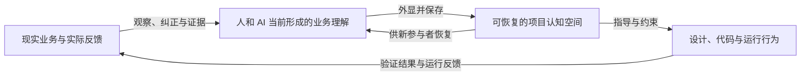
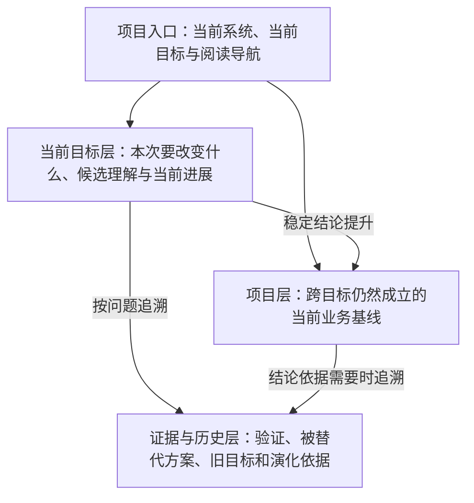
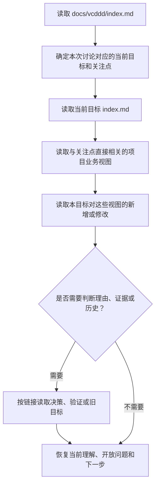
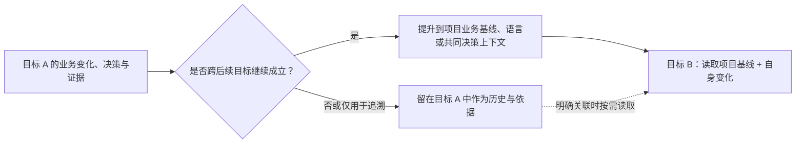

# VCDDD 2.0 阶段性成果（四）：可恢复、可演化的项目认知空间

> 状态：VCDDD 2.0 Skill 的文档存储与上下文恢复设计，后续需通过真实 Skill 试运行修正
>
> 日期：2026-07-21
>
> 前置文档：
>
> - [VCDDD 2.0 的思考起点](./1-starting-point.md)
> - [从通用语言到共同决策上下文](./2-shared-decision-context.md)
> - [从业务全貌到可开发业务基线](./3-business-discovery-and-validation.md)

## 1. 本文要解决的问题

前一阶段已经明确，VCDDD 2.0 Skill 的前半段需要帮助人和 AI 从各种不完整输入出发，逐步形成业务全貌、详细业务路线、隐藏规则、关键未知、验证证据和足以指导真实开发的当前业务基线。

但如果这些理解只存在于一次对话中，它们仍然无法支持长期的人机协同。新的 AI 不知道项目进行到了哪里，不知道哪份旧材料仍然有效，也不知道某个方案为什么被选择。即使使用了同一套领域术语，它仍然可能依靠自己的常识重新补全业务，造成无意的语义漂移。

因此，项目需要一个持续维护的外部认知空间。它不是让人和 AI 填写的一组表单，而是使项目能够跨对话、跨目标和跨参与者恢复当前理解的共同载体。

这个认知空间必须同时回答：

- 当前正在完成什么目标；
- 现在怎样理解这个系统；
- 哪些内容是稳定基线，哪些只是本次目标下的候选变化；
- 重要规则和方案为什么成立；
- 哪些结论获得了什么证据支持；
- 哪些问题仍然开放，哪些风险被明确接受；
- 本次讨论改变了什么，接下来应该继续什么；
- 新的 AI 为解决当前问题需要读取什么，而不需要读取什么。

## 2. 文档不是业务本体，而是共同认知的工作空间

系统实际运行的业务、参与者对业务的理解、项目保存的业务表达和软件实现并不是同一个东西。



文档不自动等于业务真相。它保存的是项目当前可说明、可质疑、可修正的业务认识。图、文字、原型、代码和测试都只是这一认识的不同投影；任何投影都可能不完整或过时。

它的价值不在于“文档已经齐全”，而在于让参与者能够：

1. 找到当前有效的系统解释；
2. 看见解释背后的理由、条件和证据；
3. 识别候选方案、分歧和历史结论；
4. 在新信息出现时知道应该修改哪里；
5. 判断设计与实现是否仍然表达同一个业务认识。

## 3. 记录思考，不等于保存原始思维过程

人机协同需要保留思考产生的可复核结果，但不需要保存冗长的对话全文或 AI 的原始内部推理。

真正需要长期保留的是能够重建判断的显性链路：

```text
当时要解决的问题
→ 已知事实与来源
→ 依赖的前提和潜规则
→ 被考虑的不同理解或方案
→ 使用的判断准则与利益取舍
→ 作出的当前选择及其理由
→ 尚未解决的反例和风险
→ 后续证据如何支持、限制或推翻它
```

这是一种“可解释的决策记录”，不是会议逐字稿，也不是要求 AI 把每个中间念头写进文件。

记录粒度应由语义影响决定。只有会影响业务理解、选择、风险、验证或后续行动的变化才值得持久化。临时措辞、无结果的重复推演和能够从当前结论直接推出的常识不应占据项目上下文。

## 4. 固定语义责任，不固定业务表达形式

为了让新的 AI 能可靠进入项目，需要存在少量固定接口；为了让不同项目按照自身复杂度生长，又不能规定每个项目必须拥有完全相同的文件和章节。

因此，本规范区分两类约束。

### 4.1 必须稳定的接口

- 项目只有一个共同认知入口；
- 当前目标拥有明确入口；
- 项目稳定基线与目标中的候选变化能够区分；
- 每项重要内容能说明其当前效力与关联依据；
- 新参与者可以从入口按需找到相关业务视图、决策和证据；
- 目标切换后，旧目标不会继续占据默认上下文。

### 4.2 可以随项目变化的形式

- 需要多少层业务图；
- 一个业务关注点使用流程图、状态图、时序图、表格还是文字；
- 业务视图拆成几个文件；
- 小型项目是否合并语言、规则与决策说明；
- 某项验证使用原型、技术 PoC、最小端到端实现还是其他证据；
- 讨论从用户描述、现有文档、原型、代码、运行行为还是反例开始。

规范约束的是信息怎样被找到、怎样判断效力和怎样继续演化，不是要求项目背诵一个固定模板。

## 5. 三层项目认知空间

项目认知应按照使用范围分为三个逻辑层次：项目层、当前目标层和证据历史层。



### 5.1 项目层：当前系统基线

项目层保存跨多个开发目标仍然有效的当前认识，包括：

- 系统存在的目的、范围和环境边界；
- 当前业务全貌、主要路线和核心关注点；
- 已经稳定使用的领域语言；
- 当前生效的重要业务规则和共同决策上下文；
- 影响多个目标的约束、证据和未决风险。

项目层不是“最早的设计”，而是经过后续目标修正后的当前基线。旧结论如果已经失效，就不应继续与新结论并列为当前事实。

### 5.2 当前目标层：本次工作的认知焦点

目标不是固定流程阶段，而是一段有边界的系统改变。例如“建立用户额度配置能力”和“增加模板作废规则”是两个不同目标；需求澄清、设计、实现和反馈则可能在同一目标中反复发生。

目标层保存：

- 这次为什么要改变系统；
- 期望结果、范围和不可接受结果；
- 它涉及项目基线中的哪些业务视图；
- 当前对变化的整体理解和详细业务路线；
- 候选方案、分歧、选择理由与关键未知；
- 已完成验证、接受的风险和当前结论；
- 当前进度、下一步和建议读取的文件。

目标层不复制整个项目基线。它只保存本次新增、修改、质疑或需要特别关注的内容，并通过链接关联稳定基线。

### 5.3 证据与历史层：需要时才追溯的依据

这里保存：

- 原型、技术 PoC 和端到端验证的过程与结果；
- 被放弃或被替代的方案及其适用条件；
- 已完成目标的详细讨论；
- 业务理解和实现发生变化的记录；
- 必须保留的失败尝试与负面经验。

历史材料不能因为“曾经写过”就继续指导当前实现。它们是解释当前结论的依据和未来重新讨论的入口，而不是默认加载的现行规则。

## 6. 推荐的最小目录接口

下面的结构是为了建立稳定入口和渐进加载路径，不表示每个目录下都必须提前创建空文件。

```text
docs/vcddd/
├── index.md
├── project/
│   ├── index.md
│   ├── business/
│   │   ├── index.md
│   │   └── <按业务关注点或路线命名>.md
│   ├── language.md
│   └── decision-context.md
└── goals/
    ├── <current-goal>/
    │   ├── index.md
    │   ├── business/
    │   │   ├── index.md
    │   │   └── <本目标涉及的业务视图>.md
    │   ├── decisions.md
    │   ├── validations/
    │   │   └── <验证命题>.md
    │   └── evolution.md
    └── <previous-goal>/
        └── ...
```

其中只有以下入口具有稳定含义：

- `docs/vcddd/index.md`：任何新对话进入项目时首先读取；
- `project/index.md`：项目当前基线的导航与摘要；
- `project/business/index.md`：当前业务全貌和分层业务视图入口；
- `goals/<current-goal>/index.md`：本次目标的恢复点；
- `goals/<current-goal>/business/index.md`：本目标新增或改变的业务认识入口。

其他文件根据实际内容产生。小项目可以在索引文件中直接承载语言、决策或业务说明；当内容变大、具有独立变化频率或只有特定任务才需要读取时，再拆成单独文件。不能为了满足目录外观而制造空文档。

文件应按业务问题、业务路线或稳定关注点拆分，而不是按图的技术类型拆分。`runtime-request.md`、`user-configuration.md`、`key-lifecycle.md` 比 `flowcharts.md`、`state-diagrams.md` 更能帮助人和 AI 找到相关业务。

## 7. 图与业务描述共同构成业务视图

图不应默认存放在独立的 `diagrams/` 目录中。脱离业务说明的图很容易变成无法判断目标、适用范围和当前效力的孤立附件。

一个业务视图围绕一个明确的业务问题组织。适合图形表达时，图应成为主要说明工具，文字只补充图无法可靠表达的内容。

### 7.1 图形优先表达的内容

| 当前要看清的问题 | 适合的主要表达 |
| --- | --- |
| 参与者、价值和外部关系 | 业务全景图 |
| 系统组成、责任和边界 | 组成图或上下文图 |
| 一条业务路线的入口、判断、分支与结果 | 流程图 |
| 重要对象怎样进入、变化、失效和恢复 | 状态图 |
| 多个参与者或系统之间的先后交互 | 时序图 |
| 多条件组合怎样产生不同结果 | 决策图或决策表 |

### 7.2 文字必须补充的内容

- 这张图试图回答什么问题；
- 业务目标、关注利益和不可接受结果；
- 选择某种行为的原因和被放弃的替代理解；
- 图中依赖但无法看见的前提、潜规则和适用边界；
- 哪些关系来自用户确认、现实观察、AI 推断或验证证据；
- 当前分歧、未知风险和重新讨论条件；
- 相关决策、验证和其他业务切面的链接。

### 7.3 图的边界

一个图应主要回答一个层次或一个问题。管理配置路线和运行时请求路线如果具有不同参与者、时间尺度与判断责任，就应分别表达，而不是为了“业务完整”塞进一张巨型流程图。

不同业务视图可以从不同切面描述同一业务，但必须使用一致的通用语言。流程图、状态图和时序图之间出现责任、状态、顺序或结果冲突时，AI 应把它作为业务理解冲突暴露出来。

不是每项内容都适合画图。精确定义、选择理由、隐藏假设、证据边界、失败经验和开放分歧通常应使用文字或表格。图的价值是减少理解成本，不是增加交付物数量。

## 8. 项目入口与阅读导航

`docs/vcddd/index.md` 是新 AI 唯一必须无条件读取的项目认知文件。它不承担完整业务说明，而是回答：现在是什么项目、当前做什么、从哪里继续、什么材料与本次问题有关。

项目入口至少需要表达：

- 一句话系统说明与系统边界；
- 当前主要目标及其入口；
- 项目基线入口；
- 当前最重要的开放问题或风险；
- 已完成目标的简要索引；
- 面向不同关注点的阅读导航；
- 最近一次具有业务意义的变化。

当前目标入口至少需要表达：

- 目标、动因、范围和期望结果；
- 当前对本目标的整体理解；
- 当前有效的选择与仍在竞争的理解；
- 已知未知、验证状态和接受风险；
- 本目标影响的项目业务视图；
- 当前停留位置和下一步；
- 完成本目标所需的阅读导航。

阅读导航不只是文件目录。每个入口应说明：

| 项目 | 含义 |
| --- | --- |
| 路径 | 信息保存在哪里 |
| 内容摘要 | 该文件回答什么问题 |
| 何时读取 | 哪类任务或疑问需要它 |
| 当前效力 | 当前基线、目标候选、存在分歧或历史证据 |
| 关联 | 它依赖或影响哪些其他业务视图、决策和验证 |

这些信息可以根据项目规模使用简短列表或表格表达，不要求固定格式。

## 9. 新对话的渐进加载规则

新的 AI 不应默认读完全部文档。历史越长，完整加载越容易让旧目标、失效方案和无关细节干扰当前判断。

推荐的恢复顺序是：



AI 只有在以下情况继续扩展读取范围：

- 当前问题引用了另一个业务路线或规则；
- 当前材料的效力、理由或证据不清楚；
- 两个业务视图之间出现术语或行为冲突；
- 用户要求重新讨论旧选择；
- 当前目标明确依赖以前目标中的验证或失败经验；
- 要修改的设计或代码涉及多个业务视图。

已完成目标、完整演化历史和无关验证默认不读取。入口文件若不能让 AI 判断下一步应读什么，说明认知空间的导航已经失效，应先修复入口，而不是要求后续 AI 猜测。

## 10. 内容的当前效力与权威关系

项目中最危险的问题不是材料不足，而是多份材料都像真相，却没有说明哪一份现在有效。

每项重要业务认识至少应能够被区分为：

- **当前基线**：目前用于指导设计与实现的共同认识；
- **目标内已接受变化**：本目标已经形成一致、但尚未提升到项目层的变化；
- **候选或分歧**：仍有多种合理理解，尚未选择；
- **历史或已替代**：保留用于解释和追溯，不再指导当前实现。

具体可以在标题、说明、索引或表格中表达，不要求所有文件使用同一种元数据格式。

权威关系遵循以下原则：

1. 项目层表示已经提升的当前稳定基线；
2. 处理当前目标时，项目基线与目标内已接受变化共同组成当前工作认识；
3. 尚未接受的候选方案不能被 AI 当作既定需求；
4. 验证记录提供证据，但不会自动改写业务基线；
5. 已完成目标只有被提升到项目层的结论继续有效，其余内容属于历史；
6. 代码和原型可以暴露现实行为，但不能仅凭“已经这样实现”自动成为期望业务规则。

当文档、原型、代码和运行行为冲突时，AI 应明确呈现冲突、来源和影响，不能自行选择最方便实现的一方作为真相。

## 11. 文档怎样在沟通中产生

项目认知空间允许从任何已有材料开始：一句目标描述、一段连续对话、现有原型、旧文档、截图、代码、运行系统、用户反馈或失败案例都可以成为入口。

AI 的工作不是先要求用户补齐模板，而是：

1. 阅读当前可获得的材料和项目入口；
2. 提出一个相对完整、但明确标注推断和未知的系统解释；
3. 使用合适的业务图或结构化说明让用户快速纠偏；
4. 识别会实质改变目标、利益、范围、路线或风险的问题；
5. 只针对这些高价值问题引导用户补充；
6. 将确认、纠正、分歧和证据立即更新到对应业务视图与决策上下文；
7. 持续维护目标入口中的当前状态、开放问题和下一步。

如果从原型、代码或运行系统反向还原业务，AI 必须区分：

- 能够直接观察到的现有行为；
- 用户确认希望保留的业务规则；
- 为解释现状而作出的 AI 推断；
- 可能只是历史实现限制或缺陷的行为。

现有产物是发现业务的证据，不天然等于用户意图。

## 12. 何时更新，更新什么

文档应在业务理解发生时同步演化，而不是等到一次对话结束再凭记忆总结。

出现以下变化时，AI 应立即判断并更新相应位置：

- 用户纠正了系统目标、边界或业务关系；
- 新分支暴露了隐藏规则；
- 一个候选理解被接受、拒绝或继续保留；
- 原型、PoC、代码或运行反馈提供了新证据；
- 关键未知被发现、缩小或推翻；
- 当前行动方向或下一步发生变化；
- 一个目标的结论开始影响项目长期基线。

一次语义更新至少应完成三件事：

1. 更新受影响的当前业务视图或目标理解；
2. 保存改变的理由、来源、证据强度与仍有限制；
3. 更新入口中的开放问题、下一步和阅读导航。

如果同一变化影响多个投影，AI 需要同步检查相关图、文字、决策、原型说明、设计和代码指导，避免只修改其中一个文件而产生新的语义冲突。

`evolution.md` 只保存值得追溯的语义变化，不重复保存每次文字编辑。它应让人看见什么理解在什么条件下发生了改变、为什么改变、影响了什么，而不是成为操作日志。

## 13. 多目标项目与知识提升

一个系统会连续经历多个目标。目标 A 完成以后，目标 B 往往以已经改变的系统为背景，但不应默认加载目标 A 的全部讨论。

目标切换需要进行一次知识提升：



知识提升不是把目标 A 的文件整体复制到项目层，而是判断：

- 哪些业务行为已经成为系统当前能力；
- 哪些术语已经跨目标稳定使用；
- 哪些规则、理由或约束会继续影响未来设计；
- 哪些验证结论的适用范围仍然成立；
- 哪些问题只属于当时的方案和环境。

提升完成后：

- 项目层反映已经改变后的当前系统；
- 目标 A 标记为背景或已完成目标；
- 项目入口指向新的当前目标 B；
- 目标 B 默认读取项目基线和自己的目标空间；
- 只有在存在明确依赖、需要理解理由或重新讨论旧选择时，才回到目标 A。

如果多个目标并行，项目入口必须说明本次对话正在处理哪一个目标。一个对话中的判断不能无提示地混入另一个目标空间。

## 14. 这套规范如何防止语义漂移

文档数量本身不能防止漂移。真正起作用的是以下组合：

- 新 AI 从唯一入口恢复当前目标，而不是自由挑选旧材料；
- 项目基线、目标变化、候选方案和历史证据具有明确效力差异；
- 图与业务说明共同维护，避免直观表达与文字规则分离；
- 重要选择保存理由、前提、证据和重新讨论条件；
- 每次反馈同时更新业务认识和受影响投影；
- 旧目标的持久结论经过知识提升进入当前基线；
- 设计和实现能够追溯到当前业务视图与决策，而不是只追溯到任务名称。

这不能保证项目永远不犯错，但能使错误理解更容易被发现，使改变更有意，并使参与者知道自己正在延续、质疑还是替代哪个认识。

## 15. 当前形成的文件存储原则

本阶段可以暂时收敛出以下原则：

1. 项目文档是可恢复的共同认知空间，不是一次性交付物或固定表单集；
2. 固定少量导航与权威接口，允许业务内容按照真实复杂度生长；
3. 项目稳定基线、当前目标变化和证据历史分层保存；
4. 每个新对话从项目入口和当前目标入口渐进加载，不默认读取全部历史；
5. 业务描述与适合的图形共同构成一个业务视图，图按业务问题就地保存；
6. 文件按业务关注点和路线拆分，不按 UML 图种类或工程模块机械拆分；
7. 保存可重建判断的理由、假设、分歧和证据，不保存无意义的推理流水账；
8. 重要反馈发生时同步更新认知、依据、开放问题和阅读导航；
9. 旧目标通过知识提升影响项目当前基线，其余内容退为按需读取的背景；
10. 当前效力必须显式，任何参与者都不能把候选、历史或现有实现悄然改写成业务真相。

## 16. 仍需在 Skill 设计中验证的问题

本阶段明确了文档空间承担的语义责任和推荐结构，但还不能仅凭讨论确定所有运行细节：

- Skill 如何在首次进入陌生项目时建立最小入口；
- 如何判断内容应该保留在索引、拆成业务视图还是进入决策与验证文件；
- 如何控制每次加载的上下文规模，同时避免漏读关键依赖；
- 如何在连续对话中识别值得持久化的“语义变化”；
- 如何检查图、文字、设计与实现之间的交叉冲突；
- 如何使目标完成后的知识提升既不遗漏，也不把临时方案固化为长期规则；
- 如何在用户只希望快速推进时控制文档维护成本；
- 这套目录是否能同时适应前后端产品、客户端工具和更偏技术能力的项目。

这些问题应通过 Skill 的具体设计和真实项目试运行回答，而不是继续增加抽象文件类型。

## 17. 下一阶段

至此，VCDDD 2.0 已经形成了 Skill 前半段的工作目标，以及承载共同业务理解、决策上下文、验证证据和跨对话进度的项目认知空间。

下一阶段开始正式设计 Skill：确定它在首次进入、目标建立、业务探索、按需读取、即时回写、验证选择、目标切换和知识提升时应怎样行动；哪些规则必须写入 `SKILL.md`，哪些详细说明应按需加载，以及怎样用真实项目验证这套能力确实帮助 AI 与人共同完成系统，而不是重新制造一条僵硬流程。
