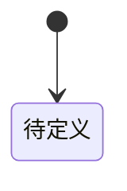

# DOM-{{NNN}}：{{Domain名称}}

> [!abstract] 主写身份
> 你是使用本 Domain 建模能力的业务 Leader。只从该 Domain 的内部主权建立事实；不要替其他 Domain 判断，也不要写入架构、API、数据库或代码承载。

候选任务来自 [[{{领域地图笔记}}]]。

## 它在现实业务中是什么

- 现实业务含义：
- 为什么当前业务中确实存在：
- 相关业务线：[[{{BL笔记}}]]
- 不应被理解成：

## 自己拥有的信息、状态与关系

### 信息与状态

| ID | 内容 | 为什么由本 Domain 拥有 | 何时产生和变化 | 业务依据 |
|---|---|---|---|---|
| `DF-001` |  |  |  | [[{{BL笔记}}]] |

### 关系

| 关系 ID | 连接什么 | 谁拥有关系 | 关系允许、限制或增加什么行为 | 生命周期 |
|---|---|---|---|---|
| `REL-001` |  | 本 Domain |  |  |

## 生命周期

- 何时产生：
- 允许的变化：
- 暂停、失效、取消或结束：
- 恢复或替换：

## 判断与行为

### BEH-{{NNN}}：{{行为名称}}

- 业务触发：
- 输入的已有事实：
- 本 Domain 依据的自身信息、状态、关系和规则：
- 作出的判断：
- 自身变化：
- 领域结果：
- 对外产生的事实或影响：
- 拒绝与失败语义：
- 明确不负责：
- 业务依据：[[{{BL笔记}}]]

## 必须始终保持的约束

| 不变量 ID | 具体约束 | 由哪些行为维护 | 被破坏时的业务后果 | 业务依据 |
|---|---|---|---|---|
| `INV-001` |  | `BEH-001` |  | [[{{BL笔记}}]] |

## 引用但不拥有的外部事实

| 外部事实 | 权威拥有者 | 本 Domain 为什么需要 | 如何使用 | 不得怎样解释 |
|---|---|---|---|---|
|  | [[{{其他Domain或来源}}]] |  |  |  |

## 对外公开的结果与影响

| 行为 | 公开结果或影响 | 可能使用它的业务线或 Domain | 稳定含义 |
|---|---|---|---|
| `BEH-001` |  | [[{{BL笔记}}]] |  |

## 非职责

- 本 Domain 不拥有：
- 本 Domain 不作出的判断：
- 不应由它承载的业务动作：

## 业务覆盖与反例

| 业务线或场景 | 相关行为 | 正常结果 | 反例、失败或恢复 | 当前是否足以解释 |
|---|---|---|---|---|
| [[{{BL笔记}}]] | `BEH-001` |  |  |  |

## 假设、冲突和反馈

| ID | 内容 | 影响 | 应返回的事实拥有者 | 状态 |
|---|---|---|---|---|
| `OPEN-001` |  |  | [[{{领域地图或业务线}}]] | `open` |

## 用户确认

- 当前成熟度：`draft`
- 用户是否明确确认：`false`
- 确认的 Domain 定义与范围：
- 确认位置或消息引用：
