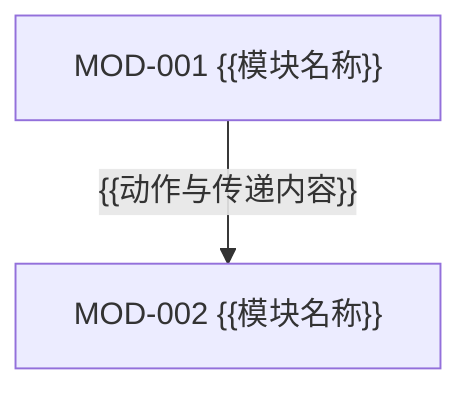
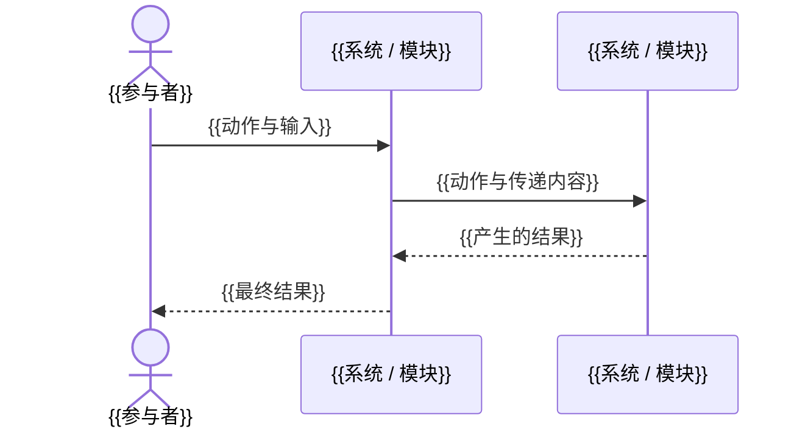

# 系统与模块设计

## 整体系统架构

## 系统

| 系统 ID | 系统 | 职责 | 提供的能力 | 可以用它完成什么 |
|---|---|---|---|---|
| `SYS-001` |  |  |  |  |

## 系统交互

| 发起方 | 接收方 | 传递内容 | 获得结果 |
|---|---|---|---|
|  |  |  |  |

## SYS-001 — {{系统名称}}

### 模块组成

### 模块

| 模块 ID | 模块 | 职责 | 提供的能力 | 被谁使用 |
|---|---|---|---|---|
| `MOD-001` |  |  |  |  |

### 模块交互

| 发起模块 | 接收模块 | 传递内容 | 获得结果 |
|---|---|---|---|
|  |  |  |  |

## 关键业务路径

| 路径 ID | 业务线 | 参与者 | 系统与模块路径 | 最终结果 |
|---|---|---|---|---|
| `PATH-001` | [[{{BL-NNN-业务线}}]] |  |  |  |

### PATH-001 — {{复杂路径名称}}

