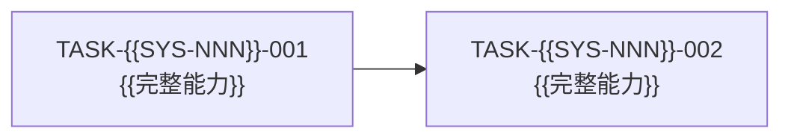

# {{系统名称}} - 开发任务图

## 当前范围

| 项目 | 当前内容 |
|---|---|
| 系统 | [[03-pre-coding/系统与模块设计#{{SYS-NNN}} — {{系统名称}}]] |
| 代码仓库 | `{{仓库路径或 URL}}` |
| 系统代码根目录 | `{{系统代码根目录}}` |
| 代码版本 | `{{COMMIT}}` |
| 编码规范 | [[04-coding/systems/{{SYS-NNN}}-{{系统名称}}/编码规范]] |
| 本轮需要形成的可运行能力 | {{能力结果}} |
| 不在本轮范围内 | {{明确排除内容}} |

## 模块能力与任务覆盖

| 模块 | 本轮需要完成的完整能力 | 对应任务 | 覆盖结果 |
|---|---|---|---|
| {{模块名称}} | {{可以实际运行和验证的能力}} | [[04-coding/systems/{{SYS-NNN}}-{{系统名称}}/tasks/TASK-{{SYS-NNN}}-{{NNN}}-{{任务名称}}/任务]] | {{完整覆盖/待补充}} |

## 任务依赖图

## 任务目录

| 任务 ID | 任务文档 | 完成后可用的结果 | 前置任务 | 依赖原因 | 可并行任务 |
|---|---|---|---|---|---|
| TASK-{{SYS-NNN}}-{{NNN}} | [[04-coding/systems/{{SYS-NNN}}-{{系统名称}}/tasks/TASK-{{SYS-NNN}}-{{NNN}}-{{任务名称}}/任务]] | {{实际可运行结果}} | {{无/任务 ID}} | {{没有该结果便无法开始的原因}} | {{任务 ID/无}} |

## 共享写入位置

| 路径或资源 | 涉及任务 | 冲突风险 | 处理方式 |
|---|---|---|---|
| `{{path-or-resource}}` | {{任务 ID}} | {{风险}} | {{拆分边界或集成顺序}} |

## 系统外依赖

只记录本系统任务真正依赖的其他系统集成结果。没有系统外依赖时删除本节。

| 本系统任务 | 对方系统 | 对方任务或集成结果 | 必须可用的能力 | 未满足时的影响 |
|---|---|---|---|---|
| TASK-{{SYS-NNN}}-{{NNN}} | [[03-pre-coding/系统与模块设计#{{依赖系统 ID}} — {{依赖系统名称}}]] | {{任务链接或固定 Commit}} | {{本任务实际使用的结果}} | {{不能开始或只能继续的部分}} |

## 编码规范影响

| 规则 ID | 影响的任务、路径或依赖 | 当前处理结果 |
|---|---|---|
| STYLE-{{SYS-NNN}}-{{NNN}} | {{影响对象}} | {{已更新/无需更新及原因}} |
